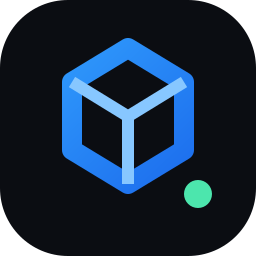
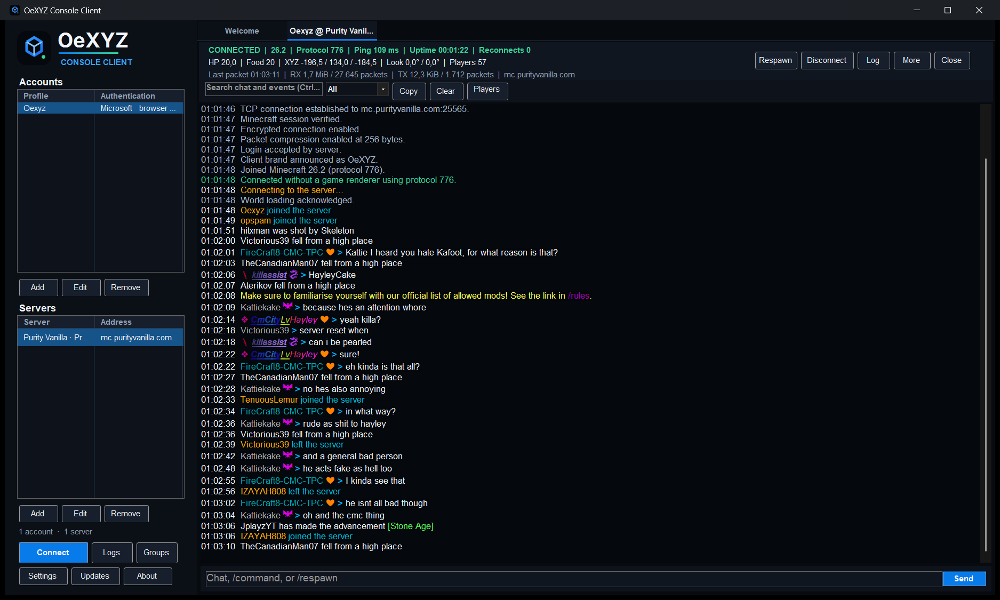
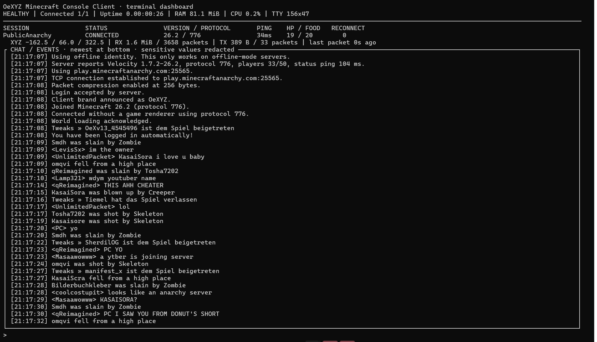
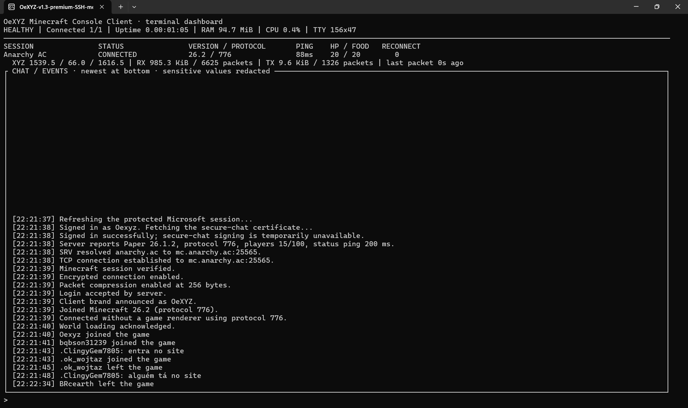
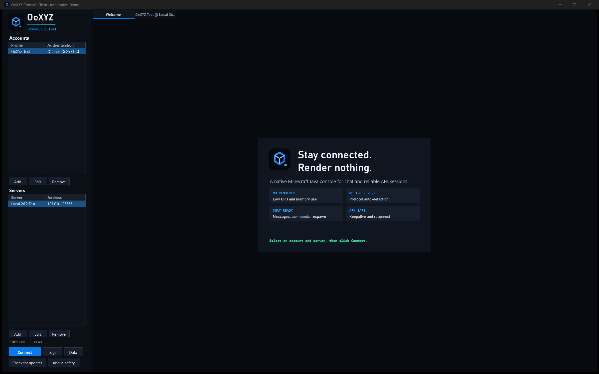

<p align="center">
  
</p>

<h1 align="center">OeXYZ Minecraft Console Client</h1>

<p align="center">
  Stay connected. Render nothing.<br>
  A native Windows GUI and self-contained headless client for Minecraft Java chat and reliable AFK sessions.
</p>

OeXYZ Console Client is a lightweight **headless Minecraft Java Edition
client**, **Minecraft console client**, and focused **AFK client** with a native
Windows GUI and a terminal frontend for Windows and Linux.
It implements the Minecraft protocol directly, uses **no renderer**, supports
**Microsoft authentication**, and connects to servers from Minecraft Java
**1.8 through 26.2** without launching the Minecraft game.

<p align="center">
  <a href="https://github.com/Oexyz/OeXYZ-Minecraft-Console-Client/actions/workflows/ci.yml"></a>
  <a href="https://github.com/Oexyz/OeXYZ-Minecraft-Console-Client/releases/latest"></a>
  
  
  
  
  <a href="LICENSE"></a>
</p>



OeXYZ keeps a real Minecraft Java session connected for chat, commands,
reconnect, and AFK use. Everything an end user needs is in two self-contained,
single-file Windows executables: the clickable GUI and optional `oexyz.exe`
headless CLI. No Node.js, Java runtime, Minecraft installation, or separate
.NET installation is needed.

## Download

Download the archive matching your Windows computer from the
[latest GitHub release](https://github.com/Oexyz/OeXYZ-Minecraft-Console-Client/releases/latest), extract it, and open
`OeXYZ Console Client.exe`.

| System | Release asset |
|---|---|
| Most Intel/AMD Windows 10/11 PCs | `OeXYZ-Minecraft-Console-Client-v1.3.1-win-x64.zip` |
| Native Windows on ARM64 | `OeXYZ-Minecraft-Console-Client-v1.3.1-win-arm64.zip` |

### Linux installer

Linux support ships with v1.3.0. Installation is one command and does not use
`sudo`:

```bash
curl -fsSL https://raw.githubusercontent.com/Oexyz/OeXYZ-Minecraft-Console-Client/main/install.sh | sh
```

The installer detects Linux x64/ARM64, requires the release SHA-256, rejects
unsafe archive paths, installs atomically into `~/.local/bin`, and never invokes
`sudo`. See [Linux deployment](docs/DEPLOYMENT.md) for systemd, Docker, account
keys, the optional pinned/attested installation method, and the exact security
boundary.

Each archive contains exactly `OeXYZ Console Client.exe` for the GUI and
`oexyz.exe` for terminal/headless use, plus documentation. The executables do
not silently fall back to another CPU architecture.

The release also contains `SHA256SUMS`. The in-app updater checks the same
manifest before accepting a downloaded archive. Releases are deliberately
**not Authenticode-signed**. SmartScreen may warn, and Windows 11 with Smart App
Control enabled can block an unsigned build. SHA-256 and GitHub's build
attestation verify archive integrity and workflow provenance, but neither
replaces an Authenticode publisher identity.

### Verify a release

Every release archive receives a GitHub artifact attestation in the pinned
[release workflow](.github/workflows/release.yml). With the
[GitHub CLI](https://cli.github.com/) installed, download and verify the latest
archive without trusting a copied checksum:

```powershell
gh release download --repo Oexyz/OeXYZ-Minecraft-Console-Client `
  --pattern 'OeXYZ-Minecraft-Console-Client-*-win-x64.zip' `
  --pattern 'SHA256SUMS'

$archive = Get-ChildItem 'OeXYZ-Minecraft-Console-Client-*-win-x64.zip' | Select-Object -First 1
$line = Get-Content SHA256SUMS | Where-Object { $_ -like "*$($archive.Name)" }
$expected = ($line -split '\s+')[0]
$actual = (Get-FileHash $archive -Algorithm SHA256).Hash
if ($actual -ne $expected) { throw 'Release checksum mismatch.' }

gh attestation verify $archive `
  --repo Oexyz/OeXYZ-Minecraft-Console-Client
```

The attestation proves which GitHub repository and workflow produced the ZIP.
The checksum detects corruption or substitution between the manifest and
archive. Neither mechanism is a substitute for reviewing the repository owner
and source code.

## What it can do

- Connect through an independent C# implementation of Minecraft Java protocols
  from **1.8 through 26.2**.
- Detect the server version automatically or use a manually selected version.
- Resolve standard Minecraft DNS SRV records while preserving the original
  handshake host.
- Respect an explicit port in the address and support a separate custom-port
  override for any host, provider, proxy, or self-hosted server.
- Sign in with Microsoft in the default browser, refresh saved sessions, and
  join online-mode servers with encrypted protocol traffic.
- Use a clearly labelled offline-mode name on servers that intentionally allow
  that authentication mode.
- Read live server messages, send chat and commands, and keep a local log.
- See a compact live dashboard with health, hunger, XYZ/look direction, real
  server-reported player ping, uptime, reconnect count, last packet, traffic,
  and packet counters.
- Search and filter chat without losing the stable scroll position; render
  Minecraft colors, bold, italic, underline, and strikethrough; copy or clear
  the view; and recall non-sensitive commands with Up/Down.
- Inspect the live TAB/player list, copy a player name, or prepare (but never
  automatically send) `/msg <player>`.
- See cached, non-blocking online status, latency, version, protocol, player
  count, MOTD, resolved endpoint, and server icon in the profile list.
- Handle keepalive, position, teleport confirmation, player-loaded state,
  compression, secure chat sessions, and the 26.x configuration phase.
- Send `/respawn` through the correct native packet, automatically respawn after
  death, classify disconnects before retrying, reconnect with bounded
  exponential backoff, detect stalled sockets conservatively, and optionally
  send a configurable small look change.
- Continue sessions explicitly in the Windows tray, connect or disconnect all
  profiles from its menu, and opt into local disconnect/reconnect/death/mention
  and private-message notifications.
- Keep the chat view stable under heavy output: incoming lines are queued,
  appended in batches, and do not steal the scroll position while reading
  older messages.
- Show newer server codes of conduct and require a deliberate approval click.
- Organize profiles into session groups, connect/disconnect a group, and opt in
  to restoring sessions that were connected at the previous clean shutdown.
- Add safe one-click quick commands and a bounded, opt-in startup-command list;
  login, registration, and password commands are blocked from automatic use.
- Browse, search, export, and explicitly delete local logs; apply 30/90-day or
  unlimited age retention with a hard 300 MB total cap that removes the oldest
  closed logs; and create a centrally redacted support ZIP.
- Inspect packet timestamp/direction/ID/name/size and local unknown-packet
  counts in an opt-in developer view. Payload/secret dumps are not produced.

## Quick start

### Clickable Windows GUI

1. Extract the release for your architecture and open
   `OeXYZ Console Client.exe`.
2. Add an account, then add a server profile. A host, `host:port`, separate
   custom port, or DNS SRV hostname is accepted.
3. Select both profiles and click **Connect**.

### Headless CLI

The CLI uses the exact same profiles, Microsoft-session store, protocol code,
and session lifecycle as the GUI:

```powershell
.\oexyz.exe list
.\oexyz.exe status survival
.\oexyz.exe run survival
```

The v1.3 Linux build uses the same commands without `.exe`. It provides a live
ANSI dashboard, but no Linux desktop GUI:

```bash
./oexyz account-add-offline TestPlayer
./oexyz server-add survival --address play.example.net
./oexyz run survival --account TestPlayer --dashboard
```

`run` is an explicit foreground process: normal output streams into that
terminal, `--dashboard` selects the full-screen view, and the shell prompt
returns after `/quit` or Ctrl+C. It intentionally stops when its SSH terminal
dies. For logout-resistant 24/7 use, run `supervise --no-input` through the
documented systemd user unit (with administrator-enabled lingering when
required) or Docker Compose; follow service chat with `journalctl`/container
logs instead of occupying the SSH shell.

To make the short command available in newly opened terminals, run this once
from the extracted release folder:

```powershell
.\oexyz.exe install-path
oexyz run survival
```

`oexyz uninstall-path` reverses only that directory entry. The helper changes
the current user's `PATH`; it installs no service and creates no shell alias.

Available commands also include profile creation, `account-login`, `doctor`,
the guided `setup`, `supervise`, health checks, portable profile import/export,
and grouped multi-session runs. Guided setup can bind several accounts to the
same server (or one account to several servers); `supervise` starts those saved
bindings automatically. Use `--account <name>` as an explicit one-account
override, `--config <path>` for an explicit profile file, `--log-file <path>` plus `--log-level`, and
`--inspect-packets` for safe metadata-only tracing. Chat and commands come from
stdin; `/quit` or Ctrl+C performs a graceful shutdown.

### Docker quick start (v1.3)

The pull-only base Compose file uses the public, prebuilt AMD64/ARM64 image. An
explicit build override enables a direct build from the checked-out repository.

To use the public image from GHCR:

```bash
docker compose run --rm oexyz setup
docker compose up -d
```

To build the image directly from this repository instead:

```bash
docker compose -f docker-compose.yml -f docker-compose.build.yml build --pull
docker compose -f docker-compose.yml -f docker-compose.build.yml run --rm oexyz setup
docker compose -f docker-compose.yml -f docker-compose.build.yml up -d --no-build
```

The default image reference is
`ghcr.io/oexyz/oexyz-minecraft-console-client:latest`, and the base service has
`pull_policy: always`, so normal setup and startup always check GHCR for the
current stable image. Set `OEXYZ_IMAGE` to use a mirror or pinned version tag.
The build override switches the policy to `never` so GHCR cannot replace a
locally built image. The Release workflow promotes `latest` only after creating
the newest stable GitHub release.

The interactive setup handles Offline or Microsoft login, server addresses,
custom ports, groups, and multiple account/server assignments. Re-run `setup`
to add another account or session without resetting existing data. Read
received messages with `docker compose logs --follow oexyz`; the background
supervisor has no chat input.

| Exit code | Meaning |
|---:|---|
| 0 | Success or deliberate shutdown |
| 2 | Profile/config target not found |
| 3 | Authentication failed |
| 4 | Protocol unsupported |
| 5 | Connection failed |
| 6 | Permanent server rejection |
| 7 | Diagnosis found a blocking local failure |
| 64 | Invalid arguments |
| 70 | Internal error |

Windows Microsoft login uses the browser flow and DPAPI shared with the GUI.
Linux v1.3 uses Microsoft's Live device-code flow and one encrypted account
session store. See the [complete CLI reference](docs/CLI.md).

## Choosing the right headless client

OeXYZ, Mineflayer, and HeadlessMc solve different problems. This is a scope
comparison, not a claim that one project is universally better:

| | OeXYZ | Mineflayer | HeadlessMc |
|---|---|---|---|
| Primary role | Clickable Windows and headless Windows/Linux chat and AFK client | Programmable JavaScript bot API | Command-line launcher for the full Minecraft client |
| Runs Minecraft game code | No; implements the protocol directly | No; connects as a bot | Yes; launches Minecraft headlessly |
| End-user runtime | Self-contained Windows EXE or Linux binary | Node.js and a bot project | Java launcher or provided native build, plus game files |
| Automation | Focused chat, commands, reconnect, respawn, anti-AFK | Broad scripting and bot ecosystem | Full-client and mod-driven control |
| Mods | No | Not Minecraft client mods | Fabric, Forge, and NeoForge workflows |
| Best fit | Non-developers who want a lightweight GUI for chat/AFK | Developers building automated agents | CI, mod testing, or full-client behavior without a screen |

See the [full comparison with scope notes and official project
sources](docs/COMPARISON.md). Feature sets change, so verify upstream
documentation before choosing a tool.

## Public offline-mode proof



The screenshot above is a real Linux x64 terminal-dashboard connection to
`play.minecraftanarchy.com` on protocol 776. A random offline test identity had
been registered once using a one-time generated value that was redacted and
never committed. This captured reconnect was passive: it sent no chat or
gameplay command, received real public messages from other players, displayed
live health/position/ping/traffic data, used over 30 visible history rows, and
shut down with exit code 0. The independently operated server is not affiliated
with or endorsed by OeXYZ. Details and limitations are in [the test
report](docs/TESTING.md).

## Premium Linux session over SSH



This is the self-contained `linux-x64` v1.3 build running on native Ubuntu
hardware through SSH. The Microsoft-authenticated protocol-776 session on
`anarchy.ac` joined with 15 players online, verified the Minecraft session,
enabled encryption, and received real public chat and join/leave events. The
dashboard shows live health, hunger, position, traffic, packet counters, and an
88 ms runtime ping. OeXYZ sent zero chat messages and zero server commands; the
local `/quit` control ended the process with exit code 0. The independently
operated server is not affiliated with this project. See the exact evidence and
limitations in [the test report](docs/TESTING.md).

## Premium proxy proof on Windows


This is a real Microsoft-authenticated protocol-776 session on
`mc.purityvanilla.com`. It shows public messages from other players, health,
hunger, position, live TAB count, ping, traffic, packet counters, and an uptime
beyond the proxy's former 60-second timeout. OeXYZ sent no chat or gameplay
automation during the capture. The compatibility fix responds to modern
play-state ping packets with the required pong while keeping the honest `OeXYZ`
brand. The independently operated server is not affiliated with this project.

## Using the app

1. Click **Add** under Accounts.
2. Choose **Microsoft account** for normal authenticated servers. OeXYZ opens
   Microsoft's browser flow when you first connect. Choose **Offline-mode name**
   only when the server owner explicitly supports it.
3. Click **Add** under Servers and enter a hostname or IP address.
4. Leave **Custom port** at `0` for SRV lookup followed by port `25565`, or enter
   the exact custom port. `host:port` is also accepted in the address field.
5. Leave the version on **auto** unless a proxy hides or misreports it.
6. Select an account and server, then click **Connect**.
7. Type chat, `/commands`, or `/respawn` in the field at the bottom. All other
   controls are clickable; a command window is never required.

Useful session controls:

- `Ctrl+F` focuses search; `Ctrl+L` clears the visible chat.
- Up/Down navigates the per-session command history. Login/register/password
  commands are deliberately excluded from that history.
- **Players** toggles the live TAB list. Double-clicking a player only prepares
  `/msg`; it does not send anything.
- **Settings** controls tray behavior and local notifications. Closing continues
  in the tray only when that option is explicitly enabled; tray **Exit** always
  shuts sessions down cleanly.
- Set an optional **Session group** in each server profile. Use **Groups**, the
  server context menu, the tray menu, or `oexyz connect-group <group>`.
- **Restore previous sessions** is a manual button by default. Automatic restore
  remains disabled until it is explicitly enabled in Settings.
- Configure up to 12 quick commands or 8 delayed startup commands per profile.
  Startup execution is disabled by default and sensitive authentication
  commands are never permitted to run automatically.
- **Logs** opens the searchable viewer. **More** inside a session exposes the
  sanitized support-package export and opt-in protocol inspector.

<details>
<summary>Welcome screen</summary>



</details>

## Why the project is auditable

The runtime is intentionally small and transparent:

| Component | Used for | Runs on an end-user machine |
|---|---|---|
| OeXYZ C# source | UI, protocol, networking, sessions, updater | Yes |
| .NET 10 runtime | Self-contained Windows/Linux application host | Yes, bundled in the release |
| CmlLib.Core.Auth.Microsoft 3.3.1 + OeXYZ Live device flow | Browser/device-code Microsoft/Xbox/Minecraft authentication | Yes |
| Windows DPAPI | Encrypting saved account sessions for the current user | Yes, built into Windows |
| AES-256-GCM + PBKDF2-SHA256 | Encrypting the Linux account/session store with a user-controlled key | Yes, built into .NET |
| Embedded Inter variable fonts | Consistent DPI-aware GUI typography | Yes, loaded locally under the SIL Open Font License |
| PrismarineJS `minecraft-data` 3.113.0 | Generating the committed packet-ID and English translation catalogs | No, build time only |

OeXYZ contains no Minecraft game executable, game assets, server JAR, hidden
launcher, advertising SDK, telemetry SDK, or remotely loaded plugin system.
The protocol code is in [`src/OeXYZ.Protocol`](src/OeXYZ.Protocol), shared
session lifecycle in [`src/OeXYZ.Session`](src/OeXYZ.Session), profiles and
policies in [`src/OeXYZ.Core`](src/OeXYZ.Core), authentication in
[`src/OeXYZ.Authentication`](src/OeXYZ.Authentication), the CLI in
[`src/OeXYZ.Cli`](src/OeXYZ.Cli), verified updating in
[`src/OeXYZ.Updater`](src/OeXYZ.Updater), and the Windows UI in
[`src/OeXYZ.ConsoleClient`](src/OeXYZ.ConsoleClient).

See also:

- [Architecture](docs/ARCHITECTURE.md)
- [Headless CLI reference](docs/CLI.md)
- [Linux, Docker, systemd, and Raspberry Pi](docs/DEPLOYMENT.md)
- [Release and updater integrity](docs/UPDATER.md)
- [Objective comparison](docs/COMPARISON.md)
- [Security and privacy](docs/SECURITY_AND_PRIVACY.md)
- [Testing evidence](docs/TESTING.md)
- [Screenshots](docs/SCREENSHOTS.md)
- [Third-party notices](THIRD_PARTY_NOTICES.md)
- [Security policy](SECURITY.md)

## Privacy and accounts

Microsoft passwords never pass through OeXYZ. Windows protects refreshable
sessions in `%LOCALAPPDATA%\OeXYZ\ConsoleClient\accounts.bin` with DPAPI for the
current user. Linux stores its refreshable account session in one bounded
AES-256-GCM file using PBKDF2-SHA256, private file modes, and an explicit
passphrase or key file that OeXYZ never prints. There is no telemetry,
analytics, advertising, or background update polling.

The only network destinations are the selected Minecraft server, DNS for SRV
discovery, Microsoft/Xbox/Minecraft authentication endpoints when signing in,
and GitHub when the user clicks **Check for updates**.

## Build from source

End users should use the self-contained release. Contributors need the .NET 10
SDK. Node.js is only needed to regenerate the packet catalog after changing the
pinned `minecraft-data` version.

```powershell
dotnet restore OeXYZ.ConsoleClient.slnx --locked-mode
dotnet build OeXYZ.ConsoleClient.slnx -c Release --no-restore
dotnet run --project tests/OeXYZ.Core.Tests -c Release --no-build
dotnet run --project tests/OeXYZ.Protocol.Tests -c Release --no-build
dotnet run --project tests/OeXYZ.ConsoleClient.Tests -c Release --no-build
dotnet run --project tests/OeXYZ.Session.Tests -c Release --no-build
dotnet run --project tests/OeXYZ.Authentication.Tests -c Release --no-build
dotnet run --project tests/OeXYZ.Cli.Tests -c Release --no-build
dotnet publish src/OeXYZ.ConsoleClient -c Release -r win-x64 --self-contained true
dotnet publish src/OeXYZ.Cli -c Release -r win-x64 --self-contained true
dotnet publish src/OeXYZ.ConsoleClient -c Release -r win-arm64 --self-contained true
dotnet publish src/OeXYZ.Cli -c Release -r win-arm64 --self-contained true
dotnet publish src/OeXYZ.Cli -c Release -r linux-x64 --self-contained true
dotnet publish src/OeXYZ.Cli -c Release -r linux-arm64 --self-contained true
```

To regenerate protocol mappings:

```powershell
npm ci
npm run generate:protocol
```

The generated catalogs currently contain 74 release mappings from protocol 47
through protocol 776 and 7,886 English translation entries. Release automation
verifies that regenerating either file produces no uncommitted difference.

## Roadmap

### v1.1 — Session experience ✅ complete

Live dashboard and metrics, intelligent reconnect, stale-connection monitoring,
tray mode, local notifications, searchable/formatted chat, command history,
live player list, cached server overview, custom-port stability, and Per-Monitor
V2 DPI scaling.

### v1.2 — Headless and reliability ✅ complete

Shared GUI/CLI session core, `oexyz` headless commands and reversible PATH
setup, session groups/restore, configurable Anti-AFK, quick/startup commands,
log viewer, redacted diagnostics, protocol inspector, fuzz/replay coverage,
Windows x64/ARM64 releases, and an architecture-aware rollback updater.

### v1.3 — Linux, Docker, and native ARM64 ✅ complete

Released in v1.3.0:

- self-contained single-file Linux x64 and native Linux ARM64 headless builds
- XDG paths, `0700` directories, `0600` profiles/keys, AES-256-GCM account and
  session storage, and Microsoft Live device-code authentication
- terminal dashboard, `doctor`, JSON status, loopback health/readiness,
  guided multi-account setup, persistent account/server assignments,
  multi-session supervisor, Ctrl+C/SIGTERM shutdown, and reversible Linux PATH
- hardened `systemd --user` service with readiness/watchdog notifications
- pinned, chiseled AMD64/ARM64 Docker image running as non-root with a read-only
  root filesystem and separate persistent config/state/key volumes
- bounded profile/account/network input, 16/32 MiB log-part rotation, a global
  300 MiB log cap, and resource-conscious reconnect/session limits

Windows/WSL2, native Ubuntu 26.04 x64 hardware, native Ubuntu 24.04 ARM64,
Docker AMD64, ARM64 cross-publish/image-manifest inspection, local Minecraft
26.2, portable DNS SRV, and a real public offline-mode server have passed. The
x64 Ubuntu hardware run also verified Microsoft Live device login, encrypted
silent refresh, a passive premium connection, and a lingering systemd user
process across separate SSH connections. The ARM64 host ran the final native
single-file CLI, verified its SHA-256, retained concurrent profile updates, and
preserved private file modes. Raspberry Pi 3 device-specific qualification is
still pending and requires a 64-bit OS.
See the [deployment guide](docs/DEPLOYMENT.md) for the exact current boundary.

## Responsible use

Server owners decide whether AFK sessions, automated movement, alternate
clients, or offline-mode accounts are permitted. Check the server's current
rules and disable features it does not allow. OeXYZ does not implement CAPTCHA
bypasses, anti-bot evasion, ban evasion, brand impersonation, spam, or automatic
account registration.

The final v1.2 passive compatibility check remained connected through a modern
Velocity proxy beyond its keepalive timeout with the honest `OeXYZ` brand and
without sending chat or gameplay automation. That compatibility result is not
a promise that every server permits AFK clients: rules and enforcement can
change, and OeXYZ will never disguise itself to bypass them.

Minecraft is a trademark of Microsoft Corporation. This project is independent
and is not affiliated with, endorsed by, or approved by Microsoft or Mojang
Studios.

## License

OeXYZ source code is available under the [MIT License](LICENSE). Third-party
components retain their own licenses as listed in
[THIRD_PARTY_NOTICES.md](THIRD_PARTY_NOTICES.md).
