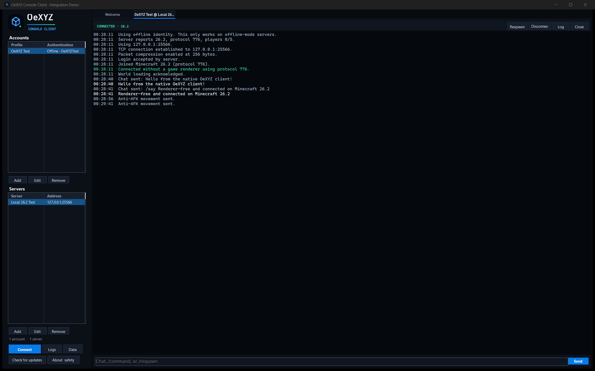
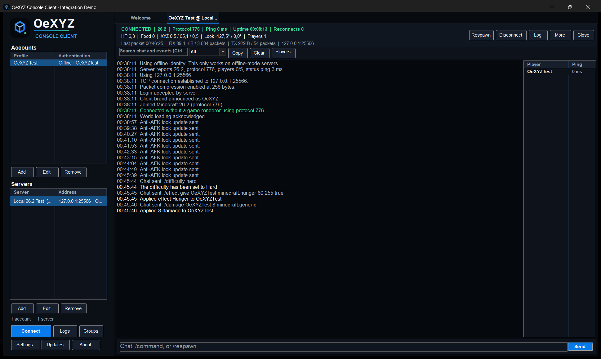
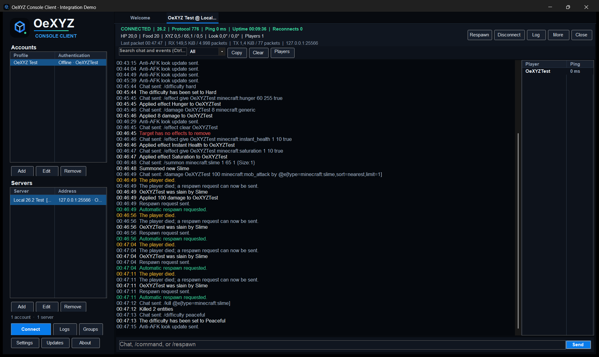

# Screenshots

These images are captured from real OeXYZ sessions. They are documentation,
not UI mockups. Local screenshots use an isolated offline-mode Mojang test
server; public screenshots contain no access token, password, private chat, or
personal server address.

## v1.1 session dashboard and player list

The dashboard values, packet/byte counters, status latency, health, position,
ping, and player list above came from a real protocol-776 connection. The same
run was used for chat, death/respawn, Disconnect/Close, and server-restart
testing described in [TESTING.md](TESTING.md).

## Welcome screen

## v1.2 health, hunger, translation, and respawn

Both images came from an official local Minecraft 26.2 server. Commands changed
the actual server-side health and hunger values; the server then killed the
offline test player with a summoned slime. OeXYZ translated the Minecraft
component key, detected death, sent the native respawn request, and recovered.

## v1.2 premium online-mode and proxy evidence

This Microsoft-authenticated session remained connected past the proxy's former
60-second timeout and received real public chat from other players. The capture
also shows the complete DPI-scaled session toolbar and live protocol metrics.
OeXYZ did not send chat or gameplay automation during the public capture.

## v1.3 Linux terminal dashboard and public offline-mode evidence

The random offline identity was registered once in an earlier setup run using a
one-time value generated only in memory; OeXYZ redacted the command from its
console, logs, and history. The photographed reconnect itself was passive and
sent no chat or gameplay command. It shows a real `linux-x64` single-file build,
protocol 776, other players' public messages, live metrics, more than 30 event
rows, a complete resized frame, and clean exit code 0. See
[TESTING.md](TESTING.md) for the exact scope.

## v1.3 premium Linux session over SSH

The same native `linux-x64` single-file build ran on an Ubuntu 26.04 x86_64
machine through SSH. This Microsoft-authenticated online-mode session verified
the Minecraft account, enabled encryption, joined `anarchy.ac` on protocol 776
with 15 players online, and passively received seven public chat/join/leave
events. The dashboard shows an 88 ms live ping, HP 20, Food 20, coordinates,
traffic, and packet counters after more than one minute. OeXYZ sent no chat or
server command, and its local `/quit` control returned exit code 0. The capture
contains no device code, token, password, or private message. Its SHA-256 is
`E07D4539CFF22F2691803ED922D932FDDC184D7D08503A117C75F0076902C534`.

## Social preview assets

The repository includes a reproducible 3840-pixel-wide master at
[`images/social-preview-4k.png`](images/social-preview-4k.png). The GitHub-ready
1280×640 derivative is generated by `tools/Build-SocialPreview.ps1`.
